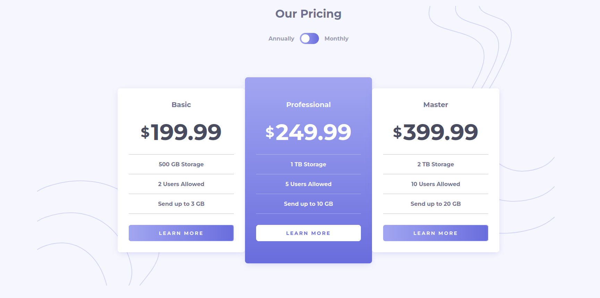

# Frontend Mentor - Pricing component with toggle solution

This is a solution to the [Pricing component with toggle challenge on Frontend Mentor](https://www.frontendmentor.io/challenges/pricing-component-with-toggle-8vPwRMIC). Frontend Mentor challenges help you improve your coding skills by building realistic projects. 

## Table of contents

- [Overview](#overview)
  - [The challenge](#the-challenge)
  - [Screenshot](#screenshot)
  - [Links](#links)
- [My process](#my-process)
  - [Built with](#built-with)
  - [What I learned](#what-i-learned)
  - [Continued development](#continued-development)
  - [Useful resources](#useful-resources)
- [Author](#author)


## Overview

### The challenge

Users should be able to:

- View the optimal layout for the component depending on their device's screen size
- Control the toggle with both their mouse/trackpad and their keyboard
- **Bonus**: Complete the challenge with just HTML and CSS

### Screenshot



### Links

- [Solution](https://www.frontendmentor.io/solutions/pricing-card-component-with-react-fnfdiXwoyV)
- [Live Solution Site](https://pricing-component-with-switch.netlify.app/)

## My process

### Built with

- Semantic HTML5 markup
- ARIA Roles and Attributes
- CSS custom properties
- Flexbox
- CSS Grid
- Mobile-first workflow
- [React](https://react.dev/learn) - JS library

### What I learned

I learned the fundamentals of React like creating components, passings props to them
and a little bit of state to manage the billing. Also using some ARIA to make the toggle
more accessible while maintaining keyboard functionality.

```js
<div className="switch-area">
  <span>Annually</span>
  <ToggleSwitch toggled={isToggled} onToggle={onToggle} />
  <span>Monthly</span>
</div>

{data.map(plan => (
  <PricingCard
    key={plan.id}
    tier={plan.tier}
    tierPrice={!isToggled ? plan.price.annual : plan.price.monthly}
    features={plan.features}
  />
))}
```

Toggle Switch:
```js
  <button
    className="toggle-switch"
    role="switch"
    aria-checked={toggled}
    aria-label={ !toggled ? "Toggle billing to monthly, currently annual" : "Toggle billing to annual, currently monthly"}
    onClick={onToggle}
  >
    <span className="thumb" aria-hidden="true"></span>
  </button>
```

### Continued development

Still a lot concepts in React to learn, as there many ways to structure state
that a simple challenge like this do not warrant it. Still want to be better
at CSS for implementing design and have better organization as well learning more
about accessibility.

### Useful resources

- [React Docs](https://react.dev/learn) - The React docs are amazing to learn it,
going from describing the ui to adding interactivity. Definitely worth taking a loot at!
- [ARIA roles & attributes](https://www.w3.org/WAI/ARIA/apg/patterns/switch/) - Thanks
to this patter I got the idea on how to implement ARIA Roles and attributes for the
toggle switch.

## Author

- Frontend Mentor - [@Shadowbest](https://www.frontendmentor.io/profile/Shadowbest)
